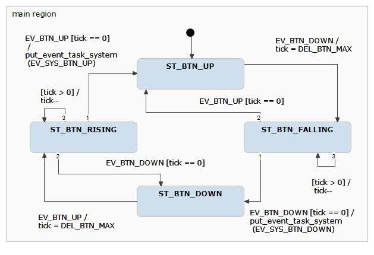
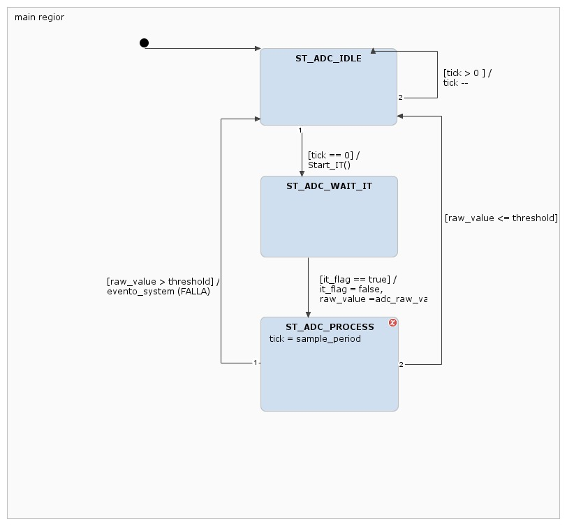
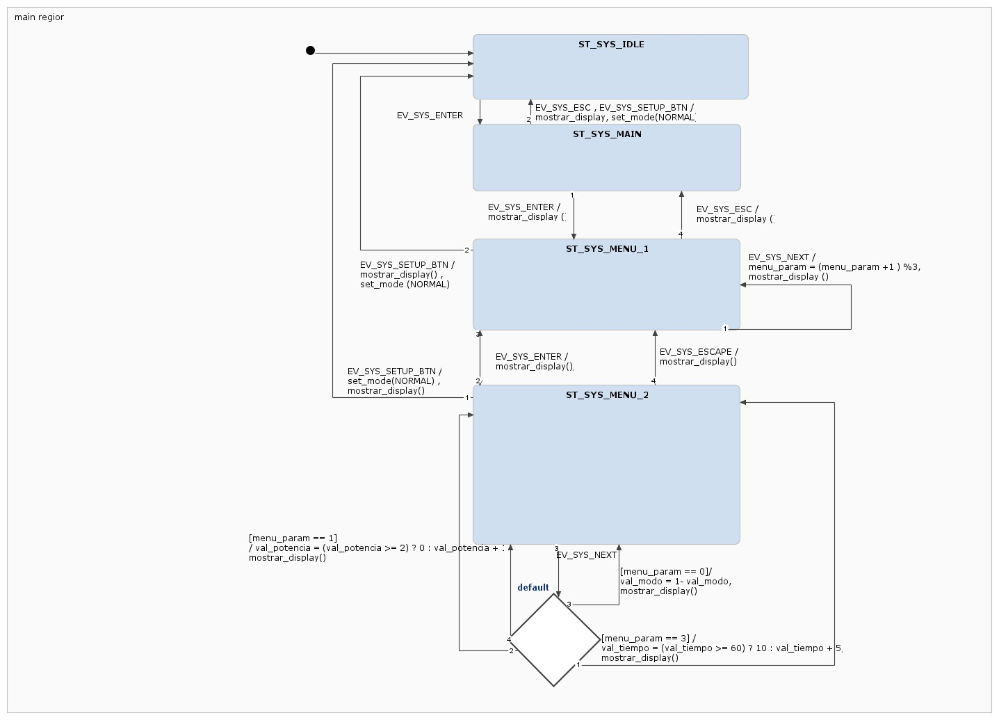
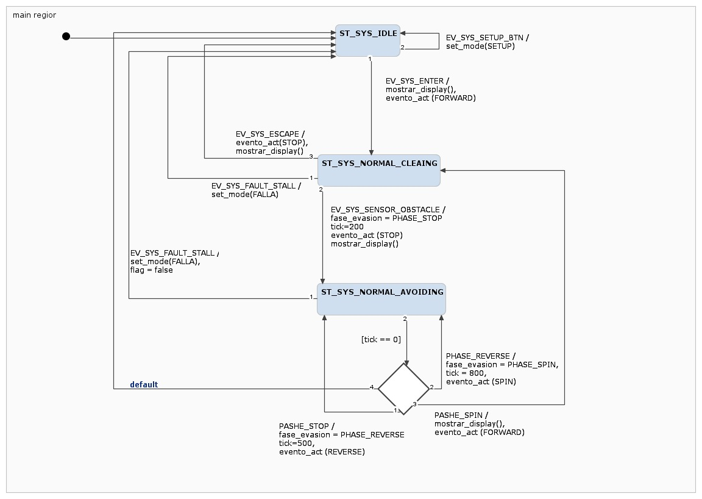
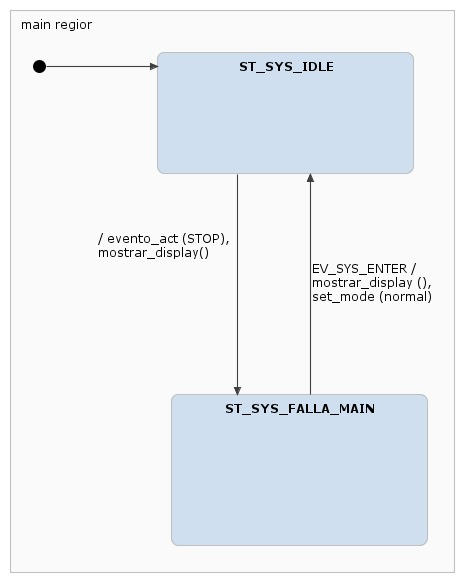
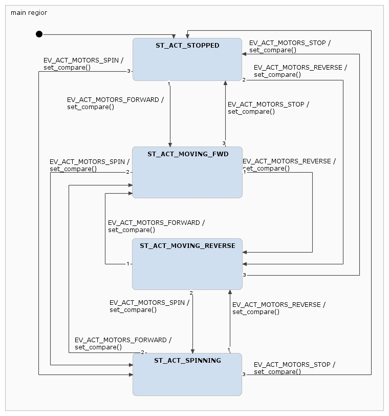
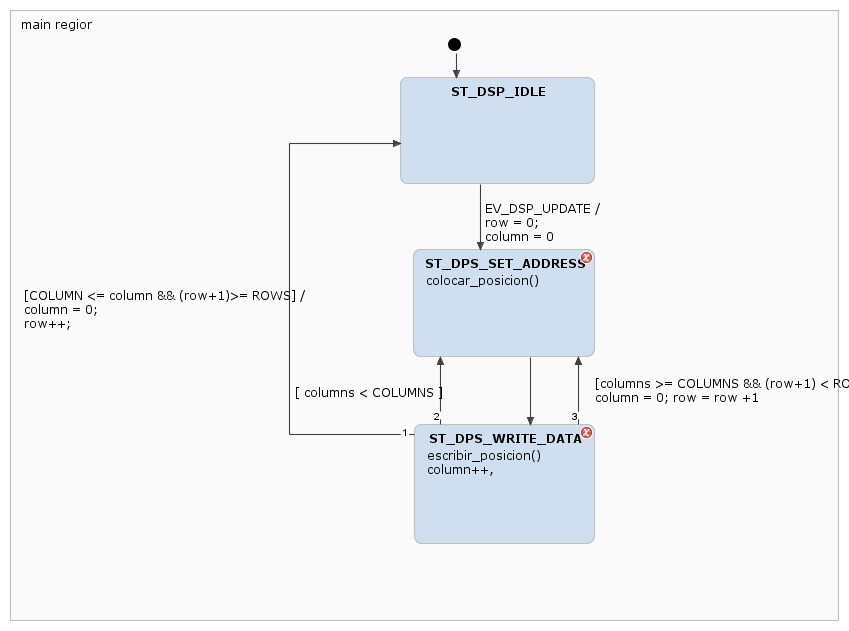

  

**UNIVERSIDAD DE BUENOS AIRES** **Facultad de Ingeniería** **TA134 – Sistemas Embebidos** # Memoria del Trabajo Final: 
## Aspiradora Inteligente (Evasión autónoma de obstáculos y monitoreo de consumo emulado)

  <table style="border-collapse: collapse; width: 35%;">
    <thead>
      <tr>
        <th align="left" style="border: 1px solid #888; padding: 8px;">Autor</th>
        <th align="center" style="border: 1px solid #888; padding: 8px;">Padrón</th>
      </tr>
    </thead>
    <tbody>
      <tr>
        <td style="border: 1px solid #888; padding: 8px;">Aguirre Lautaro</td>
        <td align="center" style="border: 1px solid #888; padding: 8px;">111870</td>
      </tr>
      <tr>
        <td style="border: 1px solid #888; padding: 8px;">Medina Mateo</td>
        <td align="center" style="border: 1px solid #888; padding: 8px;">111253</td>
      </tr>
    </tbody>
  </table>

Este trabajo fue realizado en la provincia de Buenos Aires,  
entre marzo y julio de 2026.  
**Fecha de entrega del avance de informe:** 10 de julio de 2026.

---

## RESUMEN

Se desarrollo un sistema embebido para una aspiradora inteligente capaz de evadir obstaculos de forma autonoma y monitorear su consumo energetico emulado, ademas de permitir la configuracion y control mediante un teclado matricial y un display interactivo. El proyecto surge de la necesidad de aplicar conceptos de sistemas que reaccionen ante estimulos en un entorno de electronica autonoma, garantizando seguridad y eficiencia.

El hardware se implemento sobre un microcontrolador STM32F103RB, integrando entradas analogicas que emulan los sensores de distancia y consumo, un teclado matricial para que el usuario pueda interactuar con el dispositivo, un display LCD para mostrar los distintos menus, y LEDs accionados por PWM que simulan la traccion de los motores. El firmware fue diseñado bajo una arquitectura de software estrictamente no bloqueante, estructurada en tres capas de ejecucion unidireccionales y maquinas de estados finitos coordinadas por una base de tiempo periodica de un milisegundo.

En este trabajo se busca demostrar la correcta aplicacion de las metodologias de diseño de sistemas de tiempo real aprendidas en la carrera. La documentacion incluye los ensayos de integracion, el analisis de ocupacion de memoria, el calculo del factor de uso del procesador y la medicion de los tiempos maximos de ejecucion para validar el cumplimiento de los plazos del sistema.

---

## Índice General

1. [Capítulo 1: Introducción y Objetivos](#capítulo-1-introducción-y-objetivos)
2. [Capítulo 2: Arquitectura General y Diseño de Hardware](#capítulo-2-arquitectura-general-y-diseño-de-hardware)
3. [Capítulo 3: Diseño de Firmware](#capítulo-3-diseño-de-firmware)
4. [Capítulo 4: Pruebas e Integración](#capítulo-4-pruebas-e-integración)
5. [Capítulo 5: Análisis de Rendimiento (Performance)](#capítulo-5-análisis-de-rendimiento-performance)

---

## CAPÍTULO 1
# Introducción y Objetivos

### 1.1 Contexto y motivación
El presente trabajo final se enmarca en la asignatura TA134 - Sistemas Embebidos, y tiene como propósito el diseño e implementación de un sistema de control para una aspiradora robotizada. 

La robótica móvil en entornos domésticos requiere sistemas capaces de reaccionar de manera inmediata a los estímulos del entorno (como la aparición repentina de obstáculos), sin descuidar tareas de fondo críticas como la lectura continua de sensores o la actualización de actuadores. Este proyecto permite poner en práctica el diseño de arquitecturas de firmware orientadas a eventos y sistemas de tiempo real, alejándose de la programación secuencial bloqueante.

### 1.2 Objetivos del proyecto
El objetivo principal es construir una plataforma embebida funcional, robusta y escalable. A partir del análisis de alternativas y ajustes de alcance propuestos durante el proyecto, se establecieron los siguientes objetivos específicos:
* **Navegación reactiva:** Implementar un algoritmo de evasión autónoma de obstáculos basando las decisiones en niveles de tensión emulados.
* **Gestión energética:** Desarrollar un sistema de monitoreo de consumo que permita a la aspiradora tomar decisiones según niveles de corriente emulados, generando seguridad para el entorno y alargando la vida útil del dispositivo.
* **Interacción con el usuario:** Incluir una interfaz local compuesta por un teclado matricial y un display LCD para acceder a las distintas configuraciones del sistema (modo SET UP).
* **Eficiencia computacional:** Asegurar un sistema 100% no bloqueante empleando una arquitectura basada en un *systick* de 1 ms y máquinas de estados finitos (FSM).

### 1.3 Requisitos funcionales y casos de uso
El comportamiento esperado del sistema se estructuró a través de los siguientes casos de uso principales, los cuales guiaron tanto el diseño del hardware como del software:

1. **Limpieza autónoma y evasión de obstáculos:** En modo de operación normal, el sistema emula el avance sensando el entorno continuamente. Al detectar que el potenciómetro de proximidad alcanza un valor crítico, el sistema debe indicar la detención, retroceso o giro y reanudar la marcha sin intervención humana.
2. **Monitoreo de consumo de motores:** El sistema debe adquirir periódicamente el nivel de tensión sobre un potenciómetro que emula una resistencia auxiliar (*shunt*) para calcular la corriente. Esta información debe determinar si los motores están sobreexigidos y reaccionar de manera segura.
3. **Configuración, pausa y reanudación local:** El usuario debe poder ingresar a un modo SET UP, establecer parámetros básicos e iniciar o detener la operación del robot mediante un teclado matricial, visualizando los menús interactivos y estados del sistema en todo momento a través de un display.

---

## CAPÍTULO 2
# Arquitectura General y Diseño de Hardware

### 2.1 Diagrama en bloques

El sistema se estructura en torno al microcontrolador principal, el cual recibe estímulos físicos provenientes de la interfaz de usuario (cuatro pulsadores del teclado matricial) y los sensores analógicos (consumo de motores y proximidad). A partir del procesamiento en tiempo real de estas señales, el sistema actualiza la interfaz visual (Display LCD) y controla la potencia entregada a los motores, representados mediante diodos LED de intensidad variable.

### 2.2 Descripción y selección de componentes
Dado el enfoque pedagógico orientado a la arquitectura de firmware, se optó por emular los actuadores de potencia y ciertos sensores físicos, priorizando la robustez del código de control. Los componentes utilizados son:

* **Microcontrolador:** Placa de desarrollo **STM32 NUCLEO-F103RB**. Seleccionada por su capacidad de procesamiento (ARM Cortex-M3) y la disponibilidad de múltiples instancias físicas de hardware (ADC1, ADC2, TIM3 y TIM4) necesarias para evitar colisiones en la lectura y actuación concurrente.
* **Sensores Analógicos:**
  * **Sensor de Proximidad:** Emulado mediante un Sharp IR (o potenciómetro equivalente). Permite variar un nivel de tensión que el ADC interpreta como la distancia hacia un obstáculo.
  * **Sensor de Consumo:** Emulado mediante un potenciómetro. Representa la caída de tensión sobre una resistencia *shunt* hipotética conectada a los motores, permitiendo simular condiciones de sobrecorriente mecánica.
* **Interfaz de Usuario:**
  * **Teclado:** Cuatro pulsadores independientes (ENTER, NEXT, ESCAPE, SETUP) configurados para navegar por los menús y comandar el sistema.
  * **Display LCD:** Interfaz visual primaria que muestra los menús, el estado lógico de la aspiradora y reportes de falla.
* **Actuadores Emulados:**
  * **Indicadores de Tracción (LEDs):** El funcionamiento de la rueda izquierda y derecha (marcha adelante y atrás) se simula mediante LEDs conectados a canales de PWM, permitiendo visualizar aceleración, frenado y giros.

### 2.3 Asignación de periféricos del microcontrolador
Para garantizar la independencia de los módulos y el flujo no bloqueante, los periféricos internos del STM32 se asignaron de la siguiente manera:

| Componente Lógico / Físico | Instancia STM32 | Función del Periférico |
| :--- | :--- | :--- |
| Potenciómetro (Consumo) | `ADC1` | Conversión analógica por interrupción (IT) |
| Sensor Sharp IR (Obstáculos)| `ADC2` | Conversión analógica por interrupción (IT) |
| Motor Izquierdo (FWD / REV) | `TIM3_CH1` / `TIM3_CH2` | Generación de señales PWM |
| Motor Derecho (FWD / REV) | `TIM4_CH1` / `TIM4_CH2` | Generación de señales PWM |
| Botonera de Control | `GPIO` | Lectura digital con filtro antirrebote |
| Display LCD | `GPIO / I2C` | Escritura asincrónica de datos |

---

## CAPÍTULO 3
# Diseño de Firmware

### 3.1 Arquitectura de software y base de tiempo no bloqueante
El firmware del sistema fue diseñado bajo el paradigma de sistemas reactivos, eliminando por completo las demoras bloqueantes. Toda la temporización del sistema se rige mediante una interrupción periódica del temporizador del sistema (*Systick*) configurada a **1 ms**. Mediante variables *tick* decrementales, el bucle principal evalúa la ejecución de cada tarea a su máxima velocidad de procesamiento.

### 3.2 División de tareas y flujo unidireccional
La arquitectura presenta tres capas jerárquicas con un flujo de información unidireccional (Sensor -> Sistema -> Actuador).

#### 3.2.1 Capa de Sensores (task_sensor)
Responsable de la adquisición de señales de hardware y su traducción a eventos de software.
* **`task_sensor_button`:** Escanea cuatro botones físicos (ENT, NEX, ESC, SET). Implementa una máquina de estados con un retardo de 50 ms para el filtrado de ruidos (*debounce*) en los flancos de subida y bajada.
* **`task_sensor_adc`:** Gestiona las conversiones analógicas delegando el muestreo al hardware mediante interrupciones (`HAL_ADC_Start_IT`). Posee dos instancias independientes: una evalúa la corriente cada 100 ms (umbral: 2048) y la otra la proximidad cada 50 ms (umbral: 1500).

#### 3.2.2 Capa de Sistema (task_system)
Núcleo de toma de decisiones. Deriva el control hacia la máquina de estados correspondiente:
* **`task_system_setup`:** Gestiona el menú interactivo para definir parámetros de configuración (modo, potencia, tiempo).
* **`task_system_normal`:** Orquesta la navegación. Genera comandos de avance continuo y, al recibir el evento `EV_SYS_SENSOR_OBSTACLE`, ejecuta una secuencia temporizada y no bloqueante de evasión: frenado, retroceso (500 ms) y giro (800 ms).
* **`task_system_falla`:** Mecanismo enclavado de seguridad máxima. Al recibir un evento de sobrecorriente (`EV_SYS_FAULT_STALL`), detiene los motores y solo permite la reanudación mediante una confirmación explícita del usuario.

#### 3.2.3 Capa de Actuadores (task_actuator)
Transforma los comandos lógicos en acciones sobre los periféricos.
* **`task_actuator` (Motores):** Reconfigura dinámicamente el ciclo de trabajo de los *timers* TIM3 y TIM4 (`__HAL_TIM_SET_COMPARE`) según el estado de movimiento dictado por el sistema (Stop, Forward, Reverse, Spin).
* **`task_display`:** Actualiza la matriz del LCD. Para evitar el bloqueo temporal que exige la escritura I2C, emplea una FSM que escribe la pantalla de a un carácter por ciclo, permitiendo que la CPU atienda tareas críticas entre envíos.

### 3.3 Máquinas de Estados Finitos (FSM) en detalle

A nivel de diseño, cada componente de software fue modelado rigurosamente mediante máquinas de estados finitos para garantizar el cumplimiento de los plazos temporales sin bloquear la CPU. A continuación, se detalla el comportamiento de cada módulo fundamental.

#### 3.3.1 FSM Filtro Antirrebote (Botones)
Para evitar lecturas erráticas por el rebote mecánico de los pulsadores del teclado, la tarea `task_sensor_button` implementa una FSM que evalúa la estabilidad de la señal digital antes de inyectar el evento al sistema. Al detectar un flanco de bajada (estado `FALLING`) o subida (`RISING`), la máquina aguarda un período de validación (50 ms, descontados mediante la variable `tick`). Solo si el estado físico se mantiene constante transcurrido ese tiempo, transiciona a los estados estables `DOWN` o `UP` y emite el evento correspondiente.

#### 3.3.2 FSM Muestreo Analógico (ADC)
La tarea `task_sensor_adc` gestiona las conversiones analógicas de los potenciómetros sin demorar la ejecución de otras tareas. Estando en el estado `IDLE`, al cumplirse el período de muestreo, se gatilla la conversión por hardware (`HAL_ADC_Start_IT`) y la FSM transiciona a `WAIT_IT`. La máquina permanece allí de forma no bloqueante hasta que la interrupción de hardware levanta la bandera `g_adc_it_flag`, permitiendo pasar al estado `PROCESS` para evaluar si el valor supera los umbrales de proximidad o corriente.

#### 3.3.3 FSM Capa de Sistema (Control Principal modularizado)
La tarea coordinadora `task_system` gobierna el flujo principal del dispositivo delegando el control en tres submáquinas de estados independientes y modularizadas según el modo de operación activo:

**A. Submáquina SETUP (Configuración)** Permite la navegación interactiva por el menú para configurar parámetros básicos (como modo de operación, potencia y tiempo) antes de iniciar el ciclo.

**B. Submáquina NORMAL (Navegación y Evasión)** Controla la navegación autónoma. Emite comandos de avance en el estado `CLEANING` y, al recibir un evento de obstáculo, ejecuta una secuencia temporizada de evasión en el estado `AVOIDING` (frenado, retroceso y giro sobre su eje) garantizando la no detención de la CPU.

**C. Submáquina FALLA (Seguridad)** Estado de máxima prioridad y enclavado (*latched*). Ante un pico de corriente emulado (indicando un motor trabado), detiene incondicionalmente la tracción y exige intervención humana (botón ENTER) para reconocer el error y reanudar.

#### 3.3.4 FSM Actuadores de Tracción (Motores)
La tarea `task_actuator` centraliza las órdenes de movimiento y las traduce en señales de PWM para los puentes H (emulados mediante LEDs). La máquina posee cuatro estados mutuamente excluyentes: `STOPPED`, `MOVING_FWD`, `MOVING_REVERSE` y `SPINNING`. Cada transición hacia estos estados reconfigura de manera inmediata los registros de comparación de los *Timers* de hardware (`__HAL_TIM_SET_COMPARE`) asignados a las ruedas izquierda y derecha.

#### 3.3.5 FSM Refresco de Pantalla (Display LCD)
La escritura en un display mediante bus I2C es inherentemente lenta, lo que rompería la regla de diseño no bloqueante. Por ello, `task_display` implementa una FSM que actualiza la pantalla enviando un único carácter por cada ciclo de ejecución (cada 1 ms). Mediante las variables internas `column` y `row`, el sistema recorre la matriz de la pantalla de a un casillero por vez, retornando el control al procesador inmediatamente después de cada envío.

---

## CAPÍTULO 4
# Pruebas e Integración

### 4.1 Metodología de Pruebas
Dado que el proyecto fue diseñado con una arquitectura modular y orientada a eventos, la fase de validación e integración se realizó de manera escalonada, probando cada máquina de estados de forma aislada antes de acoplarlas al flujo principal del sistema.

### 4.2 Casos de Prueba Ejecutados y Validados
Se diseñaron pruebas específicas para validar los requisitos funcionales detallados en la propuesta original:

1. **Validación del Filtro Antirrebote (Debounce):** Se simularon pulsaciones rápidas y ruidosas en el teclado matricial. Se verificó mediante depuración (Debug) que la tarea `task_sensor_button` filtró exitosamente los transitorios mecánicos, emitiendo un único evento lógico (`EV_SYS_ENTER`, `EV_SYS_NEXT`, etc.) al sistema por cada pulsación física, respetando la ventana de 50 ms.
2. **Validación de Evasión Autónoma (Caso de Uso 1):** Operando en el estado `ST_SYS_NORMAL_CLEANING`, se varió abruptamente el potenciómetro de proximidad (simulando la aparición repentina de una pared). El sistema detuvo la tracción, ejecutó la fase de marcha atrás durante 500 ms exactos y el giro durante 800 ms, para luego retomar el avance autónomo. Durante esta secuencia, el display mantuvo su actualización asincrónica sin congelarse, demostrando el carácter no bloqueante del firmware.
3. **Simulación de Falla Crítica (Caso de Uso 2):** Se elevó el nivel de tensión del potenciómetro de consumo simulando un motor trabado. La interrupción del ADC notificó a la tarea `task_sensor_adc`, la cual inyectó el evento de sobrecarga. El sistema transicionó inmediatamente desde `ST_SYS_FALLA_IDLE` a `ST_SYS_FALLA_MAIN`, deteniendo la tracción. Se verificó el correcto funcionamiento del "enclavamiento" de seguridad: el sistema ignoró cualquier estímulo hasta que se presionó explícitamente el botón *ENTER* para reanudar.

---

## CAPÍTULO 5
# Análisis de Rendimiento (Performance)

### 5.1 Ocupación de Memoria (Build Analyzer)
Tras compilar la versión actual del firmware, se evaluó el consumo de recursos estáticos del microcontrolador STM32F103RB analizando la salida de la consola de compilación. Los resultados obtenidos evidencian un uso de memoria esperado para un diseño de este estilo estructurado en múltiples máquinas de estados concurrentes.

**Asignación de Memoria por Secciones (en bytes):**
* `.text` (Código ejecutable y constantes): **29.432 bytes**
* `.data` (Variables globales inicializadas): **140 bytes**
* `.bss` (Variables globales sin inicializar): **2.836 bytes**

**Ocupación por Regiones Físicas:**
* **Memoria FLASH Total Utilizada:** 29.572 bytes (**22.56%** de 128 KB disponibles). *(Suma de .text y .data)*.
* **Memoria RAM Total Utilizada:** 2.976 bytes (**14.53%** de 20 KB disponibles). *(Suma de .data y .bss)*.

### 5.2 Análisis Temporal y Worst Case Execution Time (WCET)
La medición de tiempos se realizó íntegramente por software utilizando el contador de ciclos del hardware interno **DWT (Data Watchpoint and Trace)** del núcleo ARM Cortex-M3. Durante las sesiones de *Debug*, se sometió al sistema a un "Test de Estrés" accionando todas las transiciones posibles de las máquinas de estado para registrar el tiempo máximo absoluto que demora cada tarea. Estos valores se obtuvieron observando directamente los registros de la estructura `task_dta_list` gestionada por el planificador de tareas en el archivo `app.c`.

Los tiempos máximos (WCET) relevados para cada módulo son los siguientes:
* **Tarea Sensor (`task_sensor`):** 491 µs
* **Tarea de Control (`task_system`):** 52 µs
* **Tarea Actuador (`task_actuator`):** 12 µs

*Nota: La tarea dedicada a la interfaz visual (`task_display`) exige un tiempo de ejecución de 970 µs debido a la latencia de hardware intrínseca del protocolo I2C. Por razones de diseño arquitectónico, la temporización de esta interfaz se excluye de la métrica principal.*

**WCET del Lazo de Control:** 555 µs *(Sumatoria de los peores casos de Sensor, Sistema y Actuador).*

### 5.3 Cálculo del Factor de Uso de CPU ($U$)
El factor de uso $U$ representa la carga de procesamiento del microcontrolador en relación con la base de tiempo del sistema operativo (*Systick* configurado a 1 ms o 1000 µs). Analizando estrictamente el lazo de control reactivo, se obtiene la siguiente métrica:

$$U = \left( \frac{555 \ \mu s}{1000 \ \mu s} \right) \times 100 = 55.5\%$$

**Análisis del resultado:**
El valor de $U =$ 55.5% demuestra un diseño holgadamente planificable para el lazo de control crítico de la aspiradora. Este porcentaje indica que el procesador permanece en espera del siguiente *tick* el 44.5% del tiempo en el peor de los casos imaginables. Esto garantiza la total asimilación de eventos sin pérdidas, previene desbordamientos y otorga un amplio margen de procesamiento para futuras expansiones computacionales.

### 5.4 Consumo Energético
La medición de la corriente continua demandada por el sistema interceptando la alimentación de 3.3V con un multímetro digital se realizará en la etapa final del proyecto. Se optó por posponer este ensayo hasta contar con la placa definitiva soldada, ya que los falsos contactos en protoboards pueden generar fluctuaciones que invaliden el análisis de consumo.

* **Consumo en régimen normal operativo:** *[A MEDIR con multímetro sobre placa soldada]*