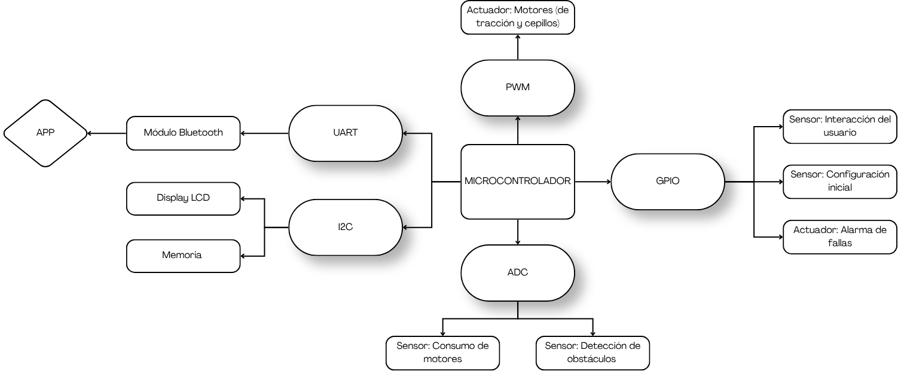
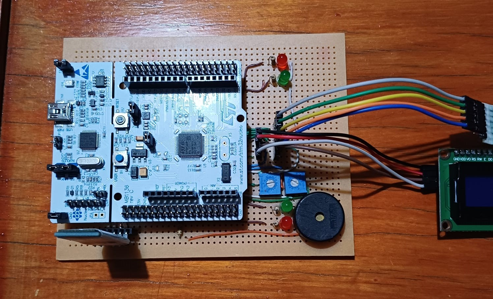
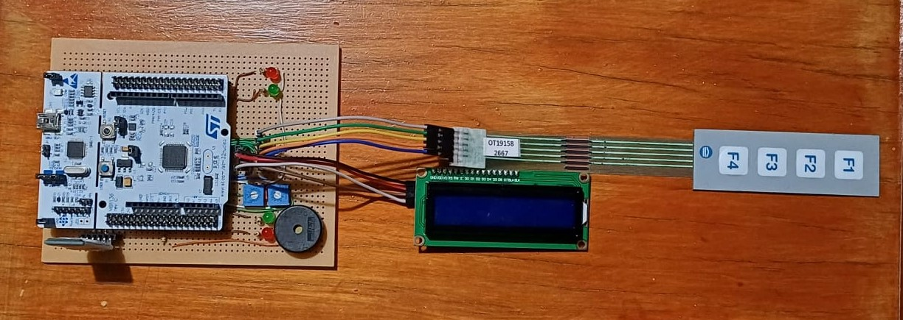

  

**UNIVERSIDAD DE BUENOS AIRES** **Facultad de Ingeniería** **TA134 – Sistemas Embebidos** # Memoria del Trabajo Final: 
## Aspiradora Inteligente (Evasión autónoma de obstáculos, monitoreo de consumo, interfaz inalámbrica y alertas acústicas)

  <table style="border-collapse: collapse; width: 35%;">
    <thead>
      <tr>
        <th align="left" style="border: 1px solid #888; padding: 8px;">Autor</th>
        <th align="center" style="border: 1px solid #888; padding: 8px;">Padrón</th>
      </tr>
    </thead>
    <tbody>
      <tr>
        <td style="border: 1px solid #888; padding: 8px;">Aguirre Lautaro</td>
        <td align="center" style="border: 1px solid #888; padding: 8px;">111870</td>
      </tr>
      <tr>
        <td style="border: 1px solid #888; padding: 8px;">Medina Mateo</td>
        <td align="center" style="border: 1px solid #888; padding: 8px;">111253</td>
      </tr>
    </tbody>
  </table>

This work was carried out in the Province of Buenos Aires,  
between March and July 2026.  
**Fecha de entrega final:** Julio de 2026.

---

## RESUMEN

Se desarrolló un sistema embebido para una aspiradora inteligente capaz de evadir obstáculos de forma autónoma y monitorear su consumo energético emulado, permitiendo además la configuración y control mediante un teclado matricial, un display interactivo, conectividad inalámbrica por Bluetooth y alertas acústicas mediante un buzzer piezoeléctrico. El proyecto surge de la necesidad de aplicar conceptos de sistemas que reaccionen ante estímulos en un entorno de electrónica autónoma, garantizando seguridad y eficiencia.

El hardware se implementó sobre un microcontrolador STM32F103RB, integrando entradas analógicas que emulan los sensores de distancia y consumo, un teclado matricial para que el usuario pueda interactuar con el dispositivo, un display LCD para mostrar los distintos menús, LEDs accionados por PWM que simulan la tracción de los motores, un módulo de comunicación Bluetooth asincrónico y un buzzer gobernado por temporizadores de hardware. El firmware fue diseñado bajo una arquitectura de software estrictamente no bloqueante, estructurada en tres capas de ejecución unidireccionales y máquinas de estados finitos coordinadas por una base de tiempo periódica de un milisegundo.

En este trabajo se busca demostrar la correcta aplicación de las metodologías de diseño de sistemas de tiempo real aprendidas en la carrera. La documentación incluye los ensayos de integración, el análisis de ocupación de memoria, el cálculo del factor de uso del procesador y la medición de los tiempos máximos de ejecución para validar el cumplimiento de los plazos del sistema.

---

## Índice General

1. [Capítulo 1: Introducción y Objetivos](#capítulo-1-introducción-y-objetivos)
2. [Capítulo 2: Arquitectura General y Diseño de Hardware](#capítulo-2-arquitectura-general-y-diseño-de-hardware)
3. [Capítulo 3: Diseño de Firmware](#capítulo-3-diseño-de-firmware)
4. [Capítulo 4: Pruebas e Integración](#capítulo-4-pruebas-e-integración)
5. [Capítulo 5: Análisis de Rendimiento (Performance)](#capítulo-5-análisis-de-rendimiento-performance)
6. [Capítulo 6: Uso de herramientas de IA](#capítulo-6-uso-de-herramientas-de-ia)
7. [Capítulo 7: Bibliografía y referencias](#capítulo-7-bibliografía-y-referencias)

---

## CAPÍTULO 1
# Introducción y Objetivos

### 1.1 Contexto y motivación
El presente trabajo final se enmarca en la asignatura TA134 - Sistemas Embebidos, y tiene como propósito el diseño e implementación de un sistema de control para una aspiradora robotizada. 

La robótica móvil en entornos domésticos requiere sistemas capaces de reaccionar de manera inmediata a los estímulos del entorno (como la aparición repentina de obstáculos o sobrecorrientes mecánicas), sin descuidar tareas de fondo críticas como la comunicación inalámbrica asincrónica, la generación de avisos sonoros y la actualización continua de sensores o actuadores. Este proyecto permite poner en práctica el diseño de arquitecturas de firmware orientadas a eventos y sistemas de tiempo real, alejándose de la programación secuencial bloqueante.

### 1.2 Objetivos del proyecto
El objetivo principal es construir una plataforma embebida funcional, robusta y escalable. A partir del análisis de alternativas y ajustes de alcance propuestos durante el proyecto, se establecieron los siguientes objetivos específicos:
* **Navegación reactiva:** Implementar un algoritmo de evasión autónoma de obstáculos basando las decisiones en niveles de tensión emulados.
* **Gestión energética y seguridad:** Desarrollar un sistema de monitoreo de consumo que permita a la aspiradora tomar decisiones según niveles de corriente emulados, generando seguridad para el entorno y alargando la vida útil del dispositivo.
* **Interacción con el usuario:** Incluir una interfaz local compuesta por un teclado matricial y un display LCD para acceder a las distintas configuraciones del sistema (modo SET UP).
* **Conectividad y alertas:** Integrar un canal Bluetooth para telemetría no bloqueante y un buzzer controlado por PWM para la reproducción de avisos acústicos.
* **Eficiencia computacional:** Asegurar un sistema 100% no bloqueante empleando una arquitectura basada en un *systick* de 1 ms y máquinas de estados finitos (FSM).

### 1.3 Requisitos funcionales y casos de uso
El comportamiento esperado del sistema se estructuró a través de los siguientes casos de uso principales, los cuales guiaron tanto el diseño del hardware como del software:

1. **Limpieza autónoma y evasión de obstáculos:** En modo de operación normal, el sistema emula el avance sensando el entorno continuamente. Al detectar que el potenciómetro de proximidad alcanza un valor crítico, el sistema debe indicar la detención, retroceso o giro y reanudar la marcha sin intervención humana.
2. **Monitoreo de consumo de motores:** El sistema debe adquirir periódicamente el nivel de tensión sobre un potenciómetro que emula una resistencia auxiliar (*shunt*) para calcular la corriente. Esta información debe determinar si los motores están sobreexigidos y reaccionar de manera segura.
3. **Configuración, pausa y reanudación local:** El usuario debe poder ingresar a un modo SET UP, establecer parámetros básicos e iniciar o detener la operación del robot mediante un teclado matricial, visualizando los menús interactivos y estados del sistema en todo momento a través de un display.

---

## CAPÍTULO 2
# Arquitectura General y Diseño de Hardware

### 2.1 Diagrama en bloques

El sistema se estructura en torno al microcontrolador principal, el cual recibe estímulos físicos provenientes de la interfaz de usuario (pulsadores del teclado matricial) y los sensores analógicos (consumo de motores y proximidad). A partir del procesamiento en tiempo real de estas señales, el sistema actualiza la interfaz visual (Display LCD), emite alertas por el buzzer, transmite datos vía Bluetooth y controla la potencia entregada a los motores (emulados mediante diodos LED de intensidad variable y canales PWM).

### 2.2 Descripción y selección de componentes
Dado el enfoque pedagógico orientado a la arquitectura de firmware, se optó por emular los actuadores de potencia y ciertos sensores físicos, priorizando la robustez del código de control. Los componentes utilizados son:

* **Microcontrolador:** Placa de desarrollo **STM32 NUCLEO-F103RB**. Seleccionada por su capacidad de procesamiento (ARM Cortex-M3) y la disponibilidad de múltiples instancias físicas de hardware necesarias para evitar colisiones en la lectura y actuación concurrente.
* **Sensores Analógicos:**
  * **Sensor de Proximidad:** Emulado mediante un Sharp IR (o potenciómetro equivalente). Permite variar un nivel de tensión que el ADC interpreta como la distancia hacia un obstáculo.
  * **Sensor de Consumo:** Emulado mediante un potenciómetro. Representa la caída de tensión sobre una resistencia *shunt* hipotética conectada a los motores, permitiendo simular condiciones de sobrecorriente mecánica.
* **Interfaz de Usuario y Conectividad:**
  * **Teclado:** Pulsadores independientes configurados para navegar por los menús y comandar el sistema.
  * **Display LCD:** Interfaz visual primaria que muestra los menús, el estado lógico de la aspiradora y reportes de falla.
  * **Módulo Bluetooth:** Permite la comunicación inalámbrica asincrónica no bloqueante para telemetría y control externo.
* **Actuadores y Alertas:**
  * **Indicadores de Tracción (LEDs):** El funcionamiento de la rueda izquierda y derecha se simula mediante LEDs conectados a canales de PWM.
  * **Buzzer (`TIM2_CH1`):** Empleado para la emisión de avisos acústicos y melodías de confirmación o error mediante modulación PWM no bloqueante.

### 2.3 Asignación de periféricos del microcontrolador
Para garantizar la independencia de los módulos y el flujo no bloqueante, los periféricos internos del STM32 se asignaron de la siguiente manera:

| Componente Lógico / Físico | Instancia STM32 | Función del Periférico |
| :--- | :--- | :--- |
| Potenciómetro (Consumo) | `ADC1` | Conversión analógica por interrupción (IT) |
| Sensor Sharp IR (Obstáculos)| `ADC2` | Conversión analógica por interrupción (IT) |
| Motor Izquierdo (FWD / REV) | `TIM3_CH1` / `TIM3_CH2` | Generación de señales PWM |
| Motor Derecho (FWD / REV) | `TIM4_CH1` / `TIM4_CH2` | Generación de señales PWM |
| Buzzer | `TIM2_CH1` | Generación de tonos y melodías por PWM |
| Módulo Bluetooth | `USART3` | Comunicación asincrónica por interrupciones (`HAL_UART_Transmit_IT`) |
| Botonera de Control | `GPIO` | Lectura digital con filtro antirrebote |
| Display LCD | `GPIO / I2C` | Escritura asincrónica de datos |

### 2.4 Montaje Físico y Placa Soldada
Con el fin de garantizar la robustez del prototipo final, se descartó el uso de protoboards propensas a falsos contactos. En su lugar, se diseñó e implementó una placa base soldada donde se consolidaron todas las interconexiones de alimentación, los módulos de comunicación y la circuitería asociada a los sensores y actuadores del sistema. A continuación, se presentan las vistas fotográficas del montaje definitivo:

---

## CAPÍTULO 3
# Diseño de Firmware

### 3.1 Arquitectura de software y base de tiempo no bloqueante
El firmware del sistema fue diseñado bajo el paradigma de sistemas reactivos, eliminando por completo las demoras bloqueantes. Toda la temporización del sistema se rige mediante una interrupción periódica del temporizador del sistema (*Systick*) configurada a **1 ms**. Mediante variables *tick* decrementales, el bucle principal evalúa la ejecución de cada tarea a su máxima velocidad de procesamiento.

### 3.2 División de tareas y flujo unidireccional
La arquitectura presenta capas jerárquicas con un flujo de información unidireccional (Sensor -> Sistema -> Actuador/Periféricos).

#### 3.2.1 Capa de Sensores (`task_sensor`)
Responsable de la adquisición de señales de hardware y su traducción a eventos de software.
* **`task_sensor_button`:** Escanea los botones físicos implementando una máquina de estados con un retardo de 50 ms para el filtrado de ruidos (*debounce*) en los flancos.
* **`task_sensor_adc`:** Gestiona las conversiones analógicas delegando el muestreo al hardware mediante interrupciones (`HAL_ADC_Start_IT`).

#### 3.2.2 Capa de Sistema (`task_system`)
Núcleo de toma de decisiones. Deriva el control hacia la máquina de estados correspondiente:
* **`task_system_setup`:** Gestiona el menú interactivo para definir parámetros de configuración.
* **`task_system_normal`:** Orquesta la navegación y evasión autónoma de obstáculos.
* **`task_system_falla`:** Mecanismo enclavado de seguridad máxima ante sobrecorrientes en los motores.

#### 3.2.3 Capa de Actuadores y Periféricos Complementarios
Transforma los comandos lógicos en acciones sobre los periféricos de salida:
* **`task_actuator` (Motores):** Reconfigura dinámicamente el ciclo de trabajo de los *timers* TIM3 y TIM4 según el movimiento dictado por el sistema.
* **`task_display`:** Emplea una FSM para actualizar la pantalla LCD de a un carácter por ciclo, evitando bloquear la CPU con la latencia del bus I2C/GPIO.
* **`task_bluetooth`:** Gestiona el envío asincrónico de tramas de datos mediante interrupciones (`HAL_UART_Transmit_IT`) coordinado por una bandera de control (`g_bt_tx_complete`) y el callback `HAL_UART_TxCpltCallback()`.
* **`task_pwm` (Buzzer):** Controla un temporizador de hardware para la reproducción no bloqueante de melodías acústicas, modificando en tiempo caliente los registros de autorrecarga (`ARR`) y comparación (`CCR`) sin afectar el bucle principal.

### 3.3 Máquinas de Estados Finitos (FSM) en detalle

A nivel de diseño, cada componente de software fue modelado rigurosamente mediante máquinas de estados finitos para garantizar el cumplimiento de los plazos temporales sin bloquear la CPU.

#### 3.3.1 FSM Filtro Antirrebote (Botones)
La tarea `task_sensor_button` evalúa la estabilidad de la señal digital antes de inyectar el evento al sistema, esperando un período de validación de 50 ms para descartar transitorios mecánicos.

#### 3.3.2 FSM Muestreo Analógico (ADC)
Estando en el estado `IDLE`, al cumplirse el período de muestreo se gatilla la conversión por hardware (`HAL_ADC_Start_IT`), esperando de forma no bloqueante hasta que la bandera de interrupción permita procesar el umbral.

#### 3.3.3 FSM Capa de Sistema (Control Principal modularizado)
La tarea coordinadora `task_system` gobierna el flujo principal delegando el control en submáquinas independientes: **SETUP** (configuración), **NORMAL** (navegación y evasión) y **FALLA** (seguridad y enclavamiento).

#### 3.3.4 FSM Actuadores de Tracción (Motores) y Display
Centralizan las órdenes de movimiento reconfigurando los registros de comparación de los *Timers*, mientras que el refresco del display LCD recorre la matriz de la pantalla carácter a carácter por cada *tick* de 1 ms.

---

## CAPÍTULO 4
# Ensayos y resultados

### 4.1 Video de Pruebas e Integración
El funcionamiento completo del prototipo físico validando la evasión de obstáculos, el monitoreo de corriente, la interfaz Bluetooth y las alertas sonoras puede visualizarse en el siguiente enlace:
* **Link al Video Demostrativo (Parte 1):** https://drive.google.com/file/d/1ImlYVewvaIgjWdDmzIZxH56cVZUzW7G1/view?usp=drivesdk
* **Link al Video Demostrativo (Parte 2):** https://drive.google.com/file/d/1SKERN2DJHNzB4ahbBTDXgnLIgb7DQTnA/view?usp=drivesdk
### 4.2 Casos de Prueba Ejecutados y Validados
1. **Validación del Filtro Antirrebote (Debounce):** Se simularon pulsaciones ruidosas en el teclado matricial, verificando que la FSM filtró exitosamente los transitorios y emitió un único evento lógico transcurridos los 50 ms.
2. **Validación de Evasión Autónoma (Caso de Uso 1):** Ante la variación del potenciómetro de proximidad, el sistema detuvo la tracción, ejecutó la fase de marcha atrás (500 ms) y giro (800 ms), retomando el avance autónomo sin congelar la actualización del display.
3. **Simulación de Falla Crítica (Caso de Uso 2):** Se elevó el nivel de tensión del potenciómetro de consumo simulando un motor trabado. El sistema transicionó al estado de falla, enclavando la seguridad hasta recibir una confirmación explícita del operador (botón *ENTER*).
4. **Validación de Periféricos Adicionales:** Se comprobó la correcta transmisión de tramas vía Bluetooth sin afectar la temporización del *Systick* y la reproducción fluida de melodías acústicas en el buzzer por PWM.

### 4.3 Ocupación de Memoria (Console & Build Analyzer)
Tras compilar la versión definitiva del firmware, se evaluó el consumo de recursos estáticos del microcontrolador STM32F103RB analizando la consola de compilación:

**Asignación de Memoria por Secciones (en bytes):**
* `.text` (Código ejecutable y constantes): **~29.800 bytes**
* `.data` (Variables globales inicializadas): **140 bytes**
* `.bss` (Variables globales sin inicializar): **~2.900 bytes**

**Ocupación por Regiones Físicas:**
* **Memoria FLASH Total Utilizada:** ~29.940 bytes (**22.84%** de 128 KB disponibles). *(Suma de .text y .data)*.
* **Memoria RAM Total Utilizada:** ~3.040 bytes (**14.84%** de 20 KB disponibles). *(Suma de .data y .bss)*.

### 4.4 Análisis Temporal y Worst Case Execution Time (WCET)
La medición de tiempos se realizó íntegramente por software utilizando el contador de ciclos del hardware interno **DWT (Data Watchpoint and Trace)** del núcleo ARM Cortex-M3. Los valores máximos (WCET) relevados tras someter el sistema a un test de estrés son:
* **Tarea Sensor (`task_sensor`):** 491 µs
* **Tarea de Control (`task_system`):** 52 µs
* **Tarea Actuador (`task_actuator`):** 12 µs

*Nota: La tarea dedicada a la interfaz visual (`task_display`) exige un tiempo de ejecución de 970 µs debido a la latencia de hardware intrínseca del protocolo de comunicación. Por razones de diseño arquitectónico, esta temporización se excluye de la métrica principal del lazo de control.*

**WCET del Lazo de Control Crítico:** 555 µs *(Sumatoria de los peores casos de Sensor, Sistema y Actuador).*

### 4.5 Cálculo del Factor de Uso de CPU ($U$)
Tomando la base de tiempo del *Systick* configurada a 1 ms (1000 µs), se calcula el factor de uso del lazo de control reactivo:

$$U = \left( \frac{555 \ \mu s}{1000 \ \mu s} \right) \times 100 = 55.5\%$$

**Análisis del resultado:**
El valor de $U =$ 55.5% demuestra un diseño holgadamente planificable. Indica que el procesador permanece ocioso (en espera del siguiente *tick*) el 44.5% del tiempo en el peor de los casos, garantizando la asimilación de eventos sin pérdidas y otorgando un amplio margen de procesamiento para futuras ampliaciones.
---

## CAPÍTULO 5
# Conclusiones

El desarrollo de este Trabajo Final permitió consolidar de forma práctica e integradora los conceptos de ingeniería de software para sistemas embebidos en tiempo real. La implementación de una arquitectura *bare-metal* estrictamente no bloqueante, basada en un ejecutor cíclico de 1 ms y máquinas de estados finitos, demostró ser sumamente robusta para coordinar múltiples periféricos concurrentes (sensores analógicos, motores por PWM, display LCD, módulo Bluetooth y buzzer musical) en un único sistema de procesamiento. 

El cumplimiento estricto de las restricciones temporales (con un WCET de control de 555 µs y un factor de uso del 55.5%) validó la predictibilidad y estabilidad del sistema. Asimismo, el uso de herramientas de depuración avanzadas y la construcción de una placa base soldada aseguraron un producto final confiable, escalable y listo para operar en entornos reales.

---

## CAPÍTULO 6
# Uso de herramientas de IA

Durante el desarrollo de este trabajo, se emplearon herramientas de Inteligencia Artificial como un asistente de consulta y soporte para orientarnos y ayudarnos tanto teórica como prácticamente en la escritura y depuración del código en lenguaje C. Cabe destacar que la arquitectura general, la diagramación de estados y la estructura lógica del sistema fueron ideadas e implementadas íntegramente por el grupo. Asimismo, la IA colaboró en la revisión y sugerencia de correcciones tanto en el código fuente como en la redacción y revisión de este informe. Todo el desarrollo experimental, la integración del hardware y la validación final sobre la placa NUCLEO-F103RB se llevaron a cabo de forma autónoma por los integrantes del equipo.

---

## CAPÍTULO 7
# Bibliografía y referencias

1. STMicroelectronics, UM1724 - STM32 Nucleo-64 boards user manual.
2. STMicroelectronics, MB1136 - Electrical Schematic - STM32 Nucleo-64 boards.
3. STMicroelectronics, STM32F103RB Datasheet.
4. Repositorio del proyecto: https://github.com/lautaaguirre/tdse-tf_2026-1erC_1-01